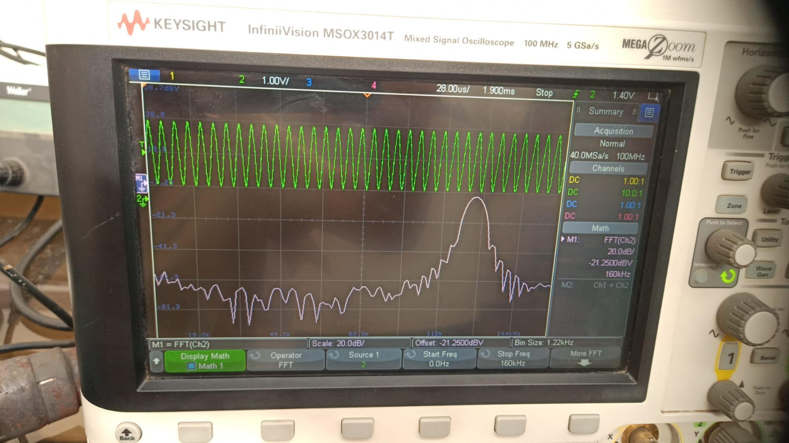
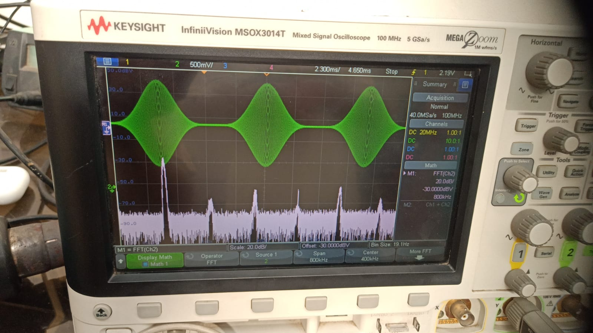
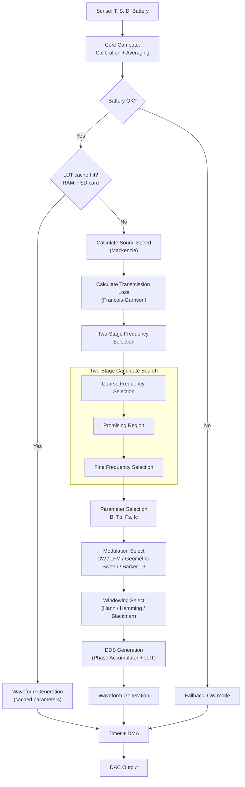

# SparkX — Ocean-Physics-Optimized Self Tunning Low Power Sonar Transmitter for AUVs

**Smart India Hackathon 2026 — Problem Statement 26058**

| Team | Team ID | PS Category | Theme |
|------|---------|-------------|-------|
| SparkX | 137 | Hardware | Robotics and Drones |
---

## Problem Statement

> **Development of a Low-Power, Real-Time Adaptive Software-Defined Sonar Transmitter Payload for Autonomous Underwater Vehicles (AUVs)**

Conventional sonar transmitters run on fixed frequency, pulse duration and amplitude settings. They cannot react to changing underwater conditions (temperature, salinity, depth) and therefore waste battery, lose signal quality, or fail to balance range against resolution.

SparkX proposes a **software-defined sonar transmitter** that senses its environment, computes the acoustically optimal transmission parameters in real time, and synthesizes a matched waveform entirely in firmware — with no hardware changes required to reconfigure it.

---

## Solution Overview

Five environmental sensors are continuously sampled, scaled and calibrated via ADC+DMA.
Mackenzie and Francois-Garrison models compute live acoustic conditions for adaptive frequency selection.
A two-stage (coarse-to-fine) numerical search evaluates transmission loss across candidate frequencies and selects the lowest-loss option.
The sonar equation derives source level and calibrated DAC amplitude.
CW / LFM / Geometric / Barker-13 and adaptive windowing provide flexible waveform generation.
DDS + sine-LUT with timer-triggered DMA streams the waveform directly to the DAC.

**Core pipeline:** `Sense → Calibrate → Real Oceanographic Calculation → Transmission loss calculation → Select Best Candidate Frequency → Source-Level Requirement & SNR Gap → Parameter, Modulation & Window Selection →  Waveform Generation - DDS phase accumulator + sine lookup table genneration
→ DMA + TIM → DAC`

### Hardware-Validated Waveforms

Captured on a Keysight InfiniiVision MSOX3014T (time domain + FFT):

|  |  |
|:---:|:---:|
| **LFM Waveform — Time Domain & FFT** | **CW Waveform — Time Domain & FFT** |

|  |  |
|:---:|:---:|
| **GS — Time Domain & FFT** | **Barker 13  — Time Domain & FFT** |

### Key Innovations

| # | Innovation | Description |
|---|---|---|
| 1 | **Low-Power Hardware DDS Architecture** | DDS + sine-LUT + Timer-triggered DMA streams samples to the DAC with minimal CPU involvement |
| 2 | **Real-Time Physics-Based Adaptation** | Live Mackenzie (sound speed) and Francois–Garrison (absorption) model evaluation drives every decision |
| 3 | **Adaptive Multi-Modulation** | Runtime selection between CW, LFM, Geometric Sweep and Barker-13 waveforms |
| 4 | **Two-Stage Frequency Selection** | Coarse-to-fine numerical search over candidate frequencies for lowest transmission loss at lowest power |

---

## System Architecture

The control-flow below mirrors the firmware decision logic (sensing → calibration → LUT cache check → adaptive computation → waveform synthesis → output):



---

## Acoustic & Signal-Processing Model

All formulas are implemented for on-device (STM32G474) computation and are traceable end-to-end from raw sensor readings to the final DAC sample stream.

### 1. Sensor Calibration
 
Raw ADC counts are converted into physical units (temperature, depth, salinity, battery voltage) before being used anywhere else in the model:
 
```
x = a·ADC + b
```
 
Here `a` (scale/slope) and `b` (offset) are **predefined constants taken from the respective sensor's datasheet**, so no separate calibration procedure is needed. The firmware simply applies these fixed coefficients to every ADC reading.

### 2. Sound Speed — Mackenzie (1981) Equation

Valid for T: 2–30 °C, S: 25–40 ppt, D: 0–8000 m.

```
c(T,S,D) = 1448.96 + 4.591T − 0.05304T² + 0.0002374T³
         + 1.340(S−35) + 0.01630D + 1.675×10⁻⁷D²
         − 0.01025T(S−35) − 7.139×10⁻¹³T·D³
```

### 3. Range & Time-of-Flight (Monostatic)

```
# Predefined (Mission specified)
```

### 4–5. Frequency-Dependent Absorption & Transmission Loss

Absorption α(f, T, S, D, pH) is evaluated via the Francois–Garrison model; combined with spreading loss:

```
TL = 20·log10(R) + α·R_km
α = 
```

## 4. Active SONAR equation

$$SNR = SL - 2\,TL - (NL - DI) + TS$$

$$\therefore\; SL = SNR_{required} + 2\,TL + (NL - DI) - TS$$

- $SL$: source level
- $SNR_{required}$: mission spec
- $NL$: noise level (later, actual receiver noise level)
- $DI$: directivity index (transducer's property)
- $TS$: target strength
 
The factor of 2 on TL accounts for the signal losing energy on both the outbound and return paths. The resulting SL (in dB re 1 µPa @ 1 m) is then mapped to the DAC drive amplitude.

### 7. Frequency Optimization (Coarse → Fine)

Candidate frequencies are scored and the lowest-cost, hardware-feasible option is selected:

```
J(f) = 2·TL(f) + E_penalty(f) + H_hardware(f)
```

Hard constraints (Nyquist limit, amplifier range) reject candidates outright rather than merely penalizing them.

### 8–9. Bandwidth, Pulse Duration & Sample Count

```
B  = c / (2·ΔR)                 # from required range resolution
Tp = TB_required / B            # from time-bandwidth product
N  = Tp · Fs
```

### 10–12. Waveform Synthesis — LFM / DDS / LUT

```
K = (f1 − f0) / Tp                          # chirp rate
Δφ[n] = 2π·f[n] / Fs
φ[n+1] = φ[n] + Δφ[n]
index  = floor((φ mod 2π) / 2π · M)         # M-entry sine LUT
```

### 13–14. Windowing & DAC Mapping

```
w[n]    = 0.5·(1 − cos(2π·n / (N−1)))       # Hann window
DAC[n]  = 2047.5 + G · A · w[n] · sin(φ[n]) # 12-bit unsigned output
```


> **Note:** Sections 2, 3, 5, 6, 8–14 are pure math, computable on the STM32 with no extra hardware. Amplitude calibration (Section 14's gain constant `G`) and the SNR feedback loop (Section 15) require a hydrophone for measured, rather than assumed, values.


---

## Adaptive Modulation

| Waveform | Role |
|---|---|
| **CW** | Fallback / low-battery mode, narrowband |
| **LFM (Chirp)** | Pulse compression for range resolution in higher-loss conditions |
| **Geometric Sweep (GS)** | Alternate wideband sweep profile |
| **Barker-13** | Phase-coded pulse compression for clutter rejection |

Modulation and windowing choice are driven by the live acoustic-loss and SNR estimates produced by the models above, not fixed at compile time.

---

## Technology Stack

| Category | Tools |
|---|---|
| Firmware | STM32CubeIDE, STM32CubeMX, STM32CubeProgrammer |
| Target MCU | STM32G474 |
| Simulation & Modeling | MATLAB, LTspice |
| PCB / Schematic | KiCad |
| Signal Analysis | DSP with FFT, Oscilloscope, Spectrum Analyzer |
| Mechanical Design | Autodesk Fusion 360 |
| Prototyping | STM32F407VGT6 (Discovery 1) |

---

## Repository Structure

```
SparkX-SIH26058/
│
├── firmware/                 STM32G474 embedded C firmware
│   └── main.c                  DDS engine, sensor acquisition, decision logic
│                               Headers / configuration
│
├── docs/                     Design documentation
│   └── images/                Flowcharts, oscilloscope captures, CAD renders
│
├── simulation/                MATLAB models (waveform + propagation simulation)
│
├── hardware/                   wiring reference
│
├── mechanical/cad/             AUV payload CAD (Fusion 360 exports)
│
├── LICENSE
└── README.md
```

> Adjust folder names above to match your actual firmware/hardware layout before pushing.

---

## Getting Started

### Prerequisites

- [STM32CubeIDE](https://www.st.com/en/development-tools/stm32cubeide.html)
- STM32G474 Nucleo/dev board (or target hardware)
- MATLAB (for simulation/verification, optional)


### Build & Flash Firmware

1. Open `firmware/` as a project in STM32CubeIDE.
2. Build the project.
3. Flash to the STM32G474 target via ST-Link.

### Run the MATLAB Simulation

Open `simulation/` in MATLAB and run the top-level script to verify waveform generation and propagation-loss calculations before deploying to hardware.

---

## Feasibility & Risk Mitigation

| Challenge | Mitigation |
|---|---|
| Illustrative mission values used in design | Replace with measured mission data during field testing |
| Amplitude calibration uncertainty | Calibrate using actual hydrophone measurements |
| SNR estimation vs. measured SNR | Validate experimentally with transmitter + receiver pair |
| Absorption model validity | Apply Francois-Garrison only within its validated frequency/environmental ranges |
| LUT extrapolation beyond validated conditions | Restrict adaptive LUT to validated frequency, amplitude and environmental regions |

---

## Impact & Applications

- Underwater mapping and bathymetric surveying
- Inspection of underwater infrastructure (pipelines, ports, offshore installations)
- Marine research and oceanography
- Search and rescue operations
- Environmental / ecosystem monitoring
- Defence and maritime security

---

## Current Prototype Scope

**Demonstrated**
- Environmental sensing + calibration pipeline
- Mackenzie sound-speed and Francois-Garrison absorption computation
- Two-stage coarse-to-fine frequency optimization
- DDS + LUT waveform synthesis (CW, LFM, Geometric Sweep, Barker-13)
- Timer + DMA driven DAC output
- MATLAB simulation of the full signal chain

**Future Development**
- Physical hydrophone-based amplitude and SNR calibration
- Dedicated transmitter PCB
- Power amplifier and transducer matching network
- Pressure-rated waterproof payload enclosure
- End-to-end in-water acoustic field testing

---

## License

This project is released under the [MIT License](LICENSE).

---

**Team SparkX | SIH26058 | K. K. Wagh Institute of Engineering Education & Research, Nashik**
