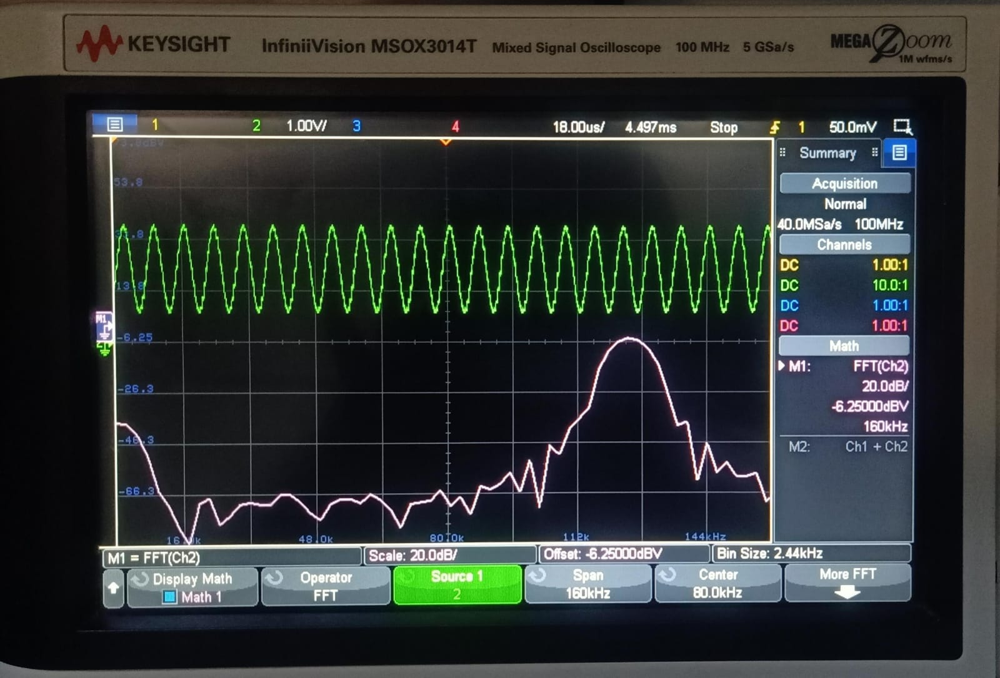
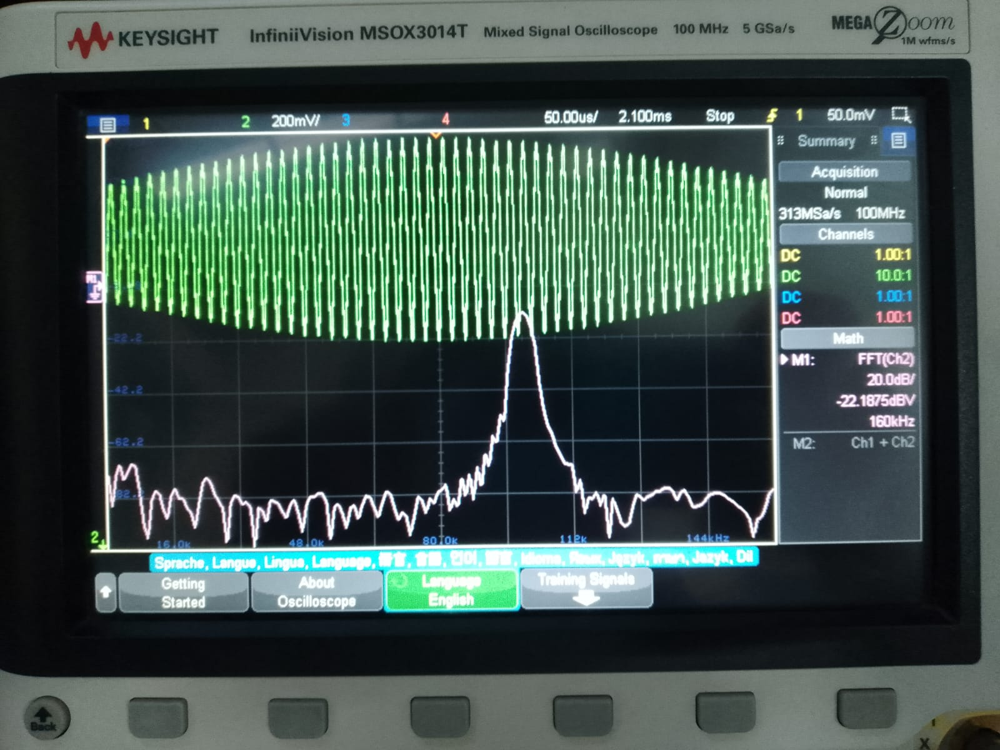
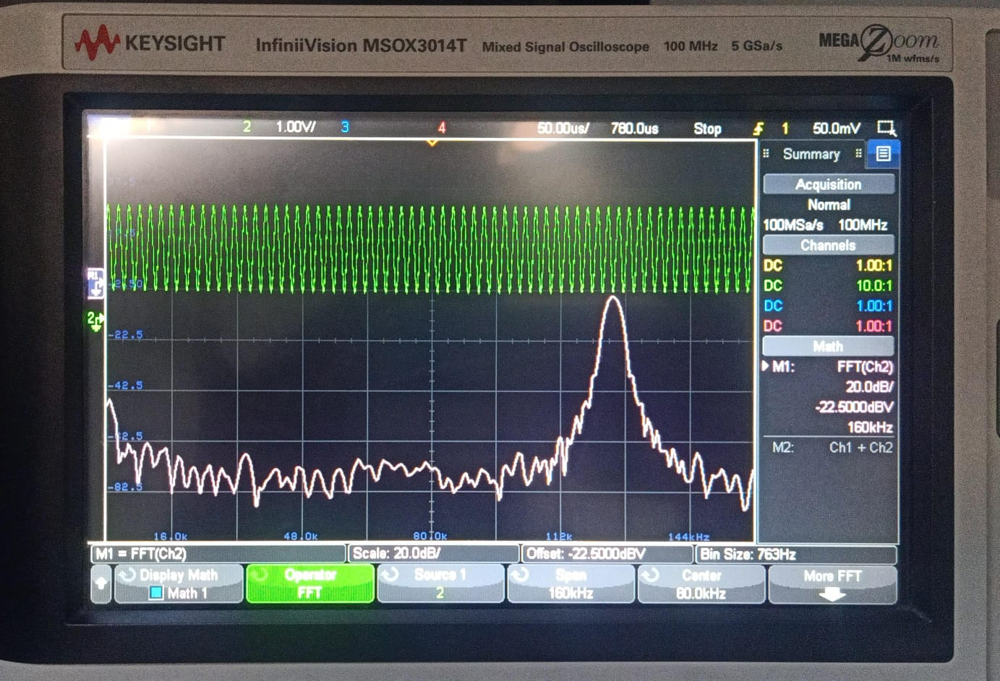
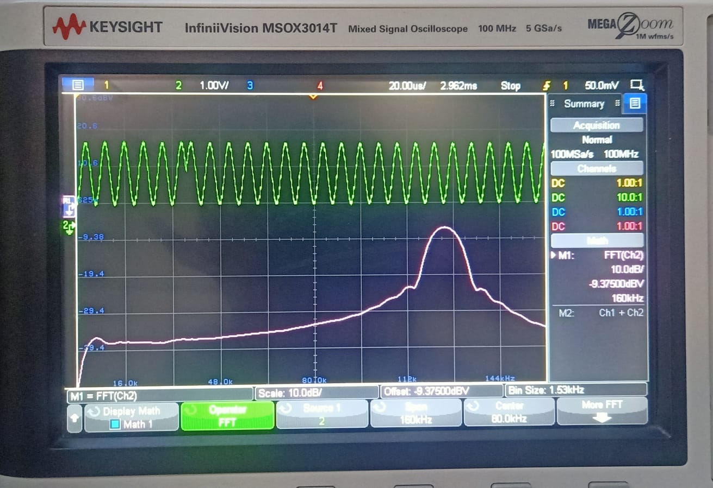
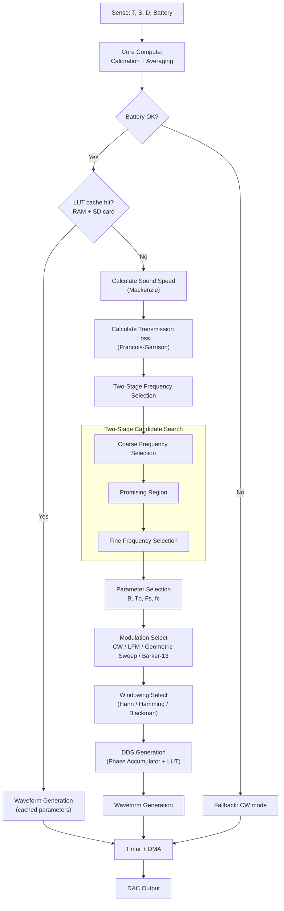

# SparkX — Ocean-Physics-Optimized Self Tunning Low Power Sonar Transmitter for AUVs

**Smart India Hackathon 2026 — Problem Statement 26058**

| Team | Team ID | PS Category | Theme |
|------|---------|-------------|-------|
| SparkX | 137 | Hardware | Robotics and Drones |
---

## Problem Statement

> **Development of a Low-Power, Real-Time Adaptive Software-Defined Sonar Transmitter Payload for Autonomous Underwater Vehicles (AUVs)**

Conventional sonar transmitters run on fixed frequency, pulse duration and amplitude settings. They cannot react to changing underwater conditions (temperature, salinity, depth) and therefore waste battery, lose signal quality, or fail to balance range against resolution.

SparkX proposes a **software-defined sonar transmitter** that senses its environment, computes the acoustically optimal transmission parameters in real time, and synthesizes a matched waveform entirely in firmware — with no hardware changes required to reconfigure it.

---

## Solution Overview

Five environmental sensors are continuously sampled, scaled and calibrated via ADC+DMA.
Mackenzie and Francois-Garrison models compute live acoustic conditions for adaptive frequency selection.
A two-stage (coarse-to-fine) numerical search evaluates transmission loss across candidate frequencies and selects the lowest-loss option.
The sonar equation derives source level and calibrated DAC amplitude.
CW / LFM / Geometric / Barker-13 and adaptive windowing provide flexible waveform generation.
DDS + sine-LUT with timer-triggered DMA streams the waveform directly to the DAC.

**Core pipeline:** `Sense → Calibrate → Real Oceanographic Calculation → Transmission loss calculation → Select Best Candidate Frequency → Source-Level Requirement & SNR Gap → Parameter, Modulation & Window Selection →  Waveform Generation - DDS phase accumulator + sine lookup table genneration
→ DMA + TIM → DAC`

### Hardware-Validated Waveforms

Captured on a Keysight InfiniiVision MSOX3014T (time domain + FFT):

|  |  |
|:---:|:---:|
| **LFM Waveform — Time Domain & FFT** | **CW Waveform — Time Domain & FFT** |

|  |  |
|:---:|:---:|
| **GS — Time Domain & FFT** | **Barker 13  — Time Domain & FFT** |

### Key Innovations

| # | Innovation | Description |
|---|---|---|
| 1 | **Low-Power Hardware DDS Architecture** | DDS + sine-LUT + Timer-triggered DMA streams samples to the DAC with minimal CPU involvement |
| 2 | **Real-Time Physics-Based Adaptation** | Live Mackenzie (sound speed) and Francois–Garrison (absorption) model evaluation drives every decision |
| 3 | **Adaptive Multi-Modulation** | Runtime selection between CW, LFM, Geometric Sweep and Barker-13 waveforms |
| 4 | **Two-Stage Frequency Selection** | Coarse-to-fine numerical search over candidate frequencies for lowest transmission loss at lowest power |

---

## System Architecture

The control-flow below mirrors the firmware decision logic (sensing → calibration → LUT cache check → adaptive computation → waveform synthesis → output):



---
```markdown
# Acoustic & Signal-Processing Model

All formulas below are implemented for on-device (STM32G474) computation and are traceable end-to-end from raw sensor readings to the final DAC sample stream. Wherever a term is **mission-specified** (fixed by the operator/mission profile rather than sensed or computed), that is stated in place, the first time the term appears — not collected separately.

---

## 1. Sensor Calibration

Raw ADC counts are converted into physical units (temperature, depth, salinity, battery voltage) before being used anywhere else in the model:

```text
x = a·ADC + b
```

`a` (scale/slope) and `b` (offset) are predefined constants taken from the respective sensor's datasheet, so no separate calibration procedure is needed at runtime. The firmware applies these fixed coefficients to every raw ADC reading before it enters the acoustic model. This step runs once per sensor, per cycle, for temperature, depth, salinity, and battery voltage.

---

## 2. Sound Speed — Mackenzie (1981) Equation

Converts the calibrated temperature, salinity, and depth readings into the actual speed of sound in the current water column. Valid for T: 2–30 °C, S: 25–40 ppt, D: 0–8000 m.

```text
c(T,S,D) = 1448.96 + 4.591T − 0.05304T² + 0.0002374T³ + 1.340(S−35) + 0.01630D + 1.675×10⁻⁷D² − 0.01025T(S−35) − 7.139×10⁻¹³T·D³
```

Inputs `T`, `S`, `D` all come from Section 1's calibrated sensor readings — nothing here is mission-specified. The output `c` (m/s) feeds Sections 3, 4, 5, and 8 below.

---

## 3. Range & Time-of-Flight (Monostatic)

For a monostatic system, the pulse travels out to the target and back over the same distance, so the round-trip time is:

```text
t_flight = 2R / c
```

Here `R` is the target/operating range in metres — **mission-specified**, since it depends on where the operator expects a target to be, not on anything the firmware senses. `c` comes from Section 2.

---

## 4. Frequency-Dependent Absorption — François & Garrison (1982)

Absorption α(f), in dB/km, is the sum of three physically distinct relaxation mechanisms in seawater: boric acid, magnesium sulfate, and pure water viscosity. Each term is evaluated separately and summed:

```text
α(f) = (A1·P1·f1·f²)/(f1² + f²) + (A2·P2·f2·f²)/(f2² + f²) + A3·P3·f²
```

**Boric acid contribution (dominant at low frequency, tens of kHz and below):**

```text
A1 = (8.86/c)·10^(0.78·pH − 5)
f1 = 2.8·√(S/35)·10^(4 − 1245/(T+273))
P1 = 1
```

`pH` (water acidity) is **mission-specified** — it is not measured by any onboard sensor in this build, so a representative seawater value is supplied at configuration time. `c`, `S`, `T` all come from Sections 2 and 1.

**Magnesium sulfate contribution (dominant in the mid-frequency range, roughly 10 kHz–500 kHz):**

```text
A2 = 21.44·(S/c)·(1 + 0.025T)
f2 = 8.17·10^(8 − 1990/(T+273)) / (1 + 0.0018(S−35))
P2 = 1 − 1.37×10⁻⁴D + 6.2×10⁻⁹D²
```

All inputs (`S`, `c`, `T`, `D`) trace back to Sections 1–2 — no mission-specified terms in this branch.

**Pure water viscosity contribution (dominant at high frequency, above ~1 MHz, included for completeness):**

```text
if T ≤ 20:  A3 = 4.937×10⁻⁴ − 2.59×10⁻⁵T + 9.11×10⁻⁷T² − 1.5×10⁻⁸T³
if T > 20:  A3 = 3.964×10⁻⁴ − 1.146×10⁻⁵T + 1.45×10⁻⁷T² − 6.5×10⁻¹⁰T³
P3 = 1 − 3.83×10⁻⁵D + 4.9×10⁻¹⁰D²
```

`f` throughout is expressed in kHz. This full three-term model is evaluated fresh for every candidate frequency tested in Section 7 — it is not a single fixed lookup, since α genuinely changes with the frequency being tested as well as with the sensed water conditions.

---

## 5. Transmission Loss (One-Way)

Combines geometric spreading loss with the frequency-dependent absorption from Section 4 over the mission range:

```text
TL(f) = 20·log10(R) + α(f)·R_km,      R_km = R / 1000
```

`R` is the same mission-specified range from Section 3. `α(f)` comes from Section 4 and depends on which candidate frequency is currently being evaluated. This one-way value is doubled in Section 6 to account for the pulse traveling out to the target and the echo traveling back.

---

## 6. Active Sonar Equation

Determines how loud (what source level) the transmitter must actually produce, given the acoustic environment and the detection requirement:

```text
SNR = SL − 2·TL − (NL − DI) + TS

∴ SL = SNR_required + 2·TL + (NL − DI) − TS
```

- `SL` — required source level (the quantity being solved for)
- `SNR_required` — minimum detectable signal-to-noise ratio for the mission; **mission-specified**, set by the detection performance the operator requires
- `NL` — ambient/receiver noise level; **mission-specified** for now (a representative environmental value), later intended to be replaced with a real measured receiver noise floor
- `DI` — directivity index, a fixed property of the transducer's beam pattern; **mission-specified** (transducer datasheet value)
- `TS` — expected target strength of whatever is being detected; **mission-specified**, since it depends on the target type the mission is designed around, not on anything sensed
- `TL` — from Section 5, doubled here for the round trip

The resulting `SL` (in dB re 1 µPa @ 1 m) is mapped to an actual DAC drive amplitude in Section 14.

---

## 7. Frequency Optimization (Coarse → Fine)

Rather than fixing one frequency, a set of candidate frequencies is scored and the lowest-cost, hardware-feasible option is selected:

```text
J(f) = 2·TL(f) + E_penalty(f) + H_hardware(f)
f* = argmin J(f)
```

`TL(f)` is recomputed per candidate from Section 5 (which itself recomputes `α(f)` from Section 4 for that specific frequency). `E_penalty(f)` scores how well the candidate's absorption profile fits the required bandwidth. `H_hardware(f)` enforces hard constraints — the Nyquist limit derived from `Fs` (Section 9) and the amplifier's usable frequency range — rejecting a candidate outright rather than merely penalizing it. The coarse pass scans a widely spaced set of candidates first; the fine pass then searches densely around whichever region scored best in the coarse pass.

---

## 8. Bandwidth

Derives the signal bandwidth needed to achieve the mission's required spatial resolution:

```text
B = c / (2·ΔR)
```

`c` comes from Section 2. `ΔR` is the required range resolution — **mission-specified**, since it reflects how finely the mission needs to distinguish two closely-spaced targets, not anything the firmware measures.

---

## 9. Pulse Duration & Sample Count

```text
Tp = TB / B
N  = Tp · Fs
```

`TB`, the time-bandwidth product, is **mission-specified** — it sets the target pulse-compression gain the mission calls for. `Fs`, the DAC/DMA sample rate, is **mission-specified** as a fixed hardware/firmware configuration value (not sensed, not computed). `B` comes from Section 8. `Tp` (pulse duration) and `N` (total sample count for the waveform buffer) are the outputs used throughout the waveform synthesis steps below.

---

## 10. Waveform Synthesis — LFM Chirp Rate

```text
K = (f1 − f0) / Tp
```

`f0` and `f1` are the chirp's start and end frequencies, derived from the optimized `f*` (Section 7) centered around the bandwidth `B` (Section 8): `f0 = f* − B/2`, `f1 = f* + B/2`. `Tp` comes from Section 9. `K` is the chirp rate — how fast frequency sweeps across the pulse — used directly in the phase accumulator below.

---

## 11. DDS Phase Accumulator

Generates the instantaneous phase of the waveform, sample by sample, in real time:

```text
Δφ[n] = 2π·f[n] / Fs
φ[n+1] = φ[n] + Δφ[n]
```

`Fs` is the same mission-specified sample rate from Section 9. `f[n]` is the instantaneous frequency at sample `n`, which sweeps linearly according to the chirp rate `K` from Section 10 for an LFM waveform (or follows a different law entirely for CW, Geometric Sweep, or Barker-coded modulation).

---

## 12. Sine Lookup Table Indexing

Rather than computing `sin()` for every sample on the CPU, the phase is used to index into a precomputed table:

```text
index = floor((φ mod 2π) / 2π · M)
```

`M` is the number of entries in the precomputed sine lookup table — a fixed firmware constant, not mission-specified or sensed. This is what lets the DAC/DMA pipeline stream samples without the CPU performing trigonometry on every single sample.

---

## 13. Windowing

Applies an amplitude envelope to taper the pulse's start and end, reducing spectral sidelobes:

```text
w[n] = 0.5·(1 − cos(2π·n / (N−1)))      # Hann window shown; Hamming/Blackman follow the same n, N pattern with different coefficients
```

`N`, the total sample count, comes from Section 9. Which window (Hann, Hamming, or Blackman) is actually applied is itself selected by a cost-based comparison, not fixed in advance — see the Parameter, Modulation & Window Selection stage.

---

## 14. DAC Mapping

The final step, converting the windowed sine sample into an actual 12-bit DAC output code:

```text
DAC[n] = 2047.5 + G·A·w[n]·sin(φ[n])    # 12-bit unsigned output
```

- `G` — calibration gain constant, bench-measured (see note below)
- `A` — drive amplitude derived from the required source level `SL` (Section 6)
- `w[n]` — window value from Section 13
- `sin(φ[n])` — looked up via Section 12's indexing into the sine table

`2047.5` centers the output in the middle of the 12-bit unsigned range (0–4095) so the waveform swings symmetrically above and below the DAC's midpoint.

---

> **Note:** Sections 2, 3, 5, 6, 8–14 are pure math, computable on the STM32 with no extra hardware. Amplitude calibration (Section 14's gain constant `G`) and the SNR feedback loop require a hydrophone for measured, rather than assumed, values.

## Adaptive Modulation

| Waveform | Role |
|---|---|
| **CW** | Fallback / low-battery mode, narrowband |
| **LFM (Chirp)** | Pulse compression for range resolution in higher-loss conditions |
| **Geometric Sweep (GS)** | Alternate wideband sweep profile |
| **Barker-13** | Phase-coded pulse compression for clutter rejection |

Modulation and windowing choice are driven by the live acoustic-loss and SNR estimates produced by the models above, not fixed at compile time.

---

## Technology Stack

| Category | Tools |
|---|---|
| Firmware | STM32CubeIDE, STM32CubeMX, STM32CubeProgrammer |
| Target MCU | STM32G474 |
| Simulation & Modeling | MATLAB, LTspice |
| PCB / Schematic | KiCad |
| Signal Analysis | DSP with FFT, Oscilloscope, Spectrum Analyzer |
| Mechanical Design | Autodesk Fusion 360 |
| Prototyping | STM32F407VGT6 (Discovery 1) |

---

## Repository Structure

```
SparkX-SIH26058/
│
├── firmware/                  STM32G474 embedded C firmware
│   └── main.c                 DDS engine, sensor acquisition, decision logic
│                              Headers / configuration
│
├── docs/                      Design documentation
│   └── image/                 Flowcharts, oscilloscope captures, CAD renders
│
├── simulation/                MATLAB models (waveform + propagation simulation)
│   └──
├── hardware/                  wiring reference
│
├── mechanical/                AUV payload CAD (Fusion 360 exports)
│
├── LICENSE
└── README.md
```

> Adjust folder names above to match your actual firmware/hardware layout before pushing.

---

## Getting Started

### Prerequisites

- [STM32CubeIDE](https://www.st.com/en/development-tools/stm32cubeide.html)
- STM32G474 Nucleo/dev board (or target hardware)
- MATLAB (for simulation/verification, optional)


### Build & Flash Firmware

1. Open `firmware/` as a project in STM32CubeIDE.
2. Build the project.
3. Flash to the STM32G474 target via ST-Link.

### Run the MATLAB Simulation

Open `simulation/` in MATLAB and run the top-level script to verify waveform generation and propagation-loss calculations before deploying to hardware.

---

## Feasibility & Risk Mitigation

| Challenge | Mitigation |
|---|---|
| Illustrative mission values used in design | Replace with measured mission data during field testing |
| Amplitude calibration uncertainty | Calibrate using actual hydrophone measurements |
| SNR estimation vs. measured SNR | Validate experimentally with transmitter + receiver pair |
| Absorption model validity | Apply Francois-Garrison only within its validated frequency/environmental ranges |
| LUT extrapolation beyond validated conditions | Restrict adaptive LUT to validated frequency, amplitude and environmental regions |

---

## Impact & Applications

- Underwater mapping and bathymetric surveying
- Inspection of underwater infrastructure (pipelines, ports, offshore installations)
- Marine research and oceanography
- Search and rescue operations
- Environmental / ecosystem monitoring
- Defence and maritime security

---

## Current Prototype Scope

**Demonstrated**
- Environmental sensing + calibration pipeline
- Mackenzie sound-speed and Francois-Garrison absorption computation
- Two-stage coarse-to-fine frequency optimization
- DDS + LUT waveform synthesis (CW, LFM, Geometric Sweep, Barker-13)
- Timer + DMA driven DAC output
- MATLAB simulation of the full signal chain

**Future Development**
- Physical hydrophone-based amplitude and SNR calibration
- Dedicated transmitter PCB
- Power amplifier and transducer matching network
- Pressure-rated waterproof payload enclosure
- End-to-end in-water acoustic field testing

---

## License

This project is released under the [MIT License](LICENSE).

---

**Team SparkX | SIH26058 | K. K. Wagh Institute of Engineering Education & Research, Nashik**
