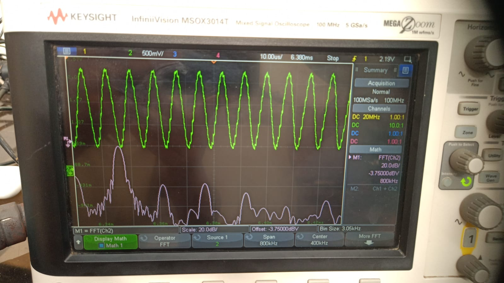
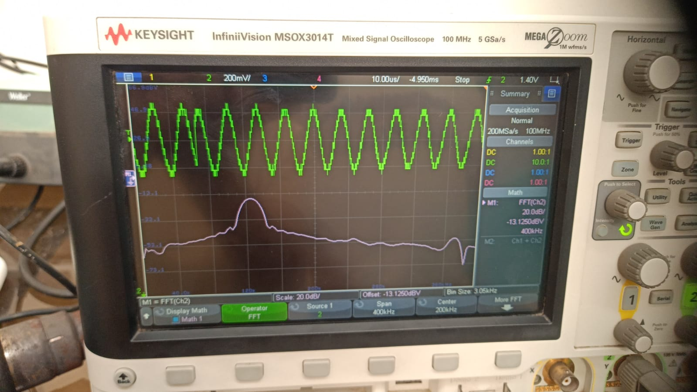
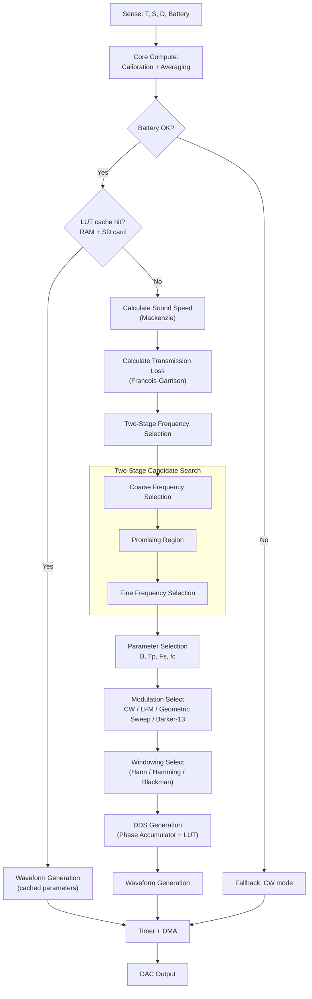

# SparkX — Adaptive Software-Defined Sonar Transmitter Payload

**Smart India Hackathon 2026 — Problem Statement 26058**


| Team | Team ID | PS Category | Theme | Institution |
|---|---|---|---|---|
| **SparkX** | **137** | Hardware | Robotics and Drones | K. K. Wagh Institute of Engineering Education & Research, Nashik |

---

## Problem Statement

> **Development of a Low-Power, Real-Time Adaptive Software-Defined Sonar Transmitter Payload for Autonomous Underwater Vehicles (AUVs)**

Conventional sonar transmitters run on fixed frequency, pulse duration and amplitude settings. They cannot react to changing underwater conditions (temperature, salinity, depth) and therefore waste battery, lose signal quality, or fail to balance range against resolution.

SparkX proposes a **software-defined sonar transmitter** that senses its environment, computes the acoustically optimal transmission parameters in real time, and synthesizes a matched waveform entirely in firmware — with no hardware changes required to reconfigure it.

---

## Solution Overview

The payload continuously samples five environmental/system inputs (temperature, salinity, depth, and battery/system state), runs them through physics-based acoustic models, and derives the transmission parameters that minimize propagation loss while meeting the mission's resolution and SNR requirements. The resulting waveform is generated on-chip via DDS and streamed to the DAC using Timer + DMA, keeping the CPU free for the next sensing/decision cycle.

**Core pipeline:** `Sense → Calibrate → Model Acoustics → Select Frequency → Select Waveform → Synthesize (DDS) → Stream (DMA) → Transmit (DAC)`

### Hardware-Validated Waveforms

Captured on a Keysight InfiniiVision MSOX3014T (time domain + FFT):

|  |  |
|:---:|:---:|
| **LFM Waveform — Time Domain & FFT** | **CW Waveform — Time Domain & FFT** |

|  |  |
|:---:|:---:|
| **GS — Time Domain & FFT** | *Barker 13  — Time Domain & FFT** |

### Key Innovations

| # | Innovation | Description |
|---|---|---|
| 1 | **Low-Power Hardware DDS Architecture** | DDS + sine-LUT + Timer-triggered DMA streams samples to the DAC with minimal CPU involvement |
| 2 | **Real-Time Physics-Based Adaptation** | Live Mackenzie (sound speed) and Francois–Garrison (absorption) model evaluation drives every decision |
| 3 | **Adaptive Multi-Modulation** | Runtime selection between CW, LFM, Geometric Sweep and Barker-13 waveforms |
| 4 | **Two-Stage Frequency Selection** | Coarse-to-fine numerical search over candidate frequencies for lowest transmission loss at lowest power |

---

## System Architecture

The control-flow below mirrors the firmware decision logic (sensing → calibration → LUT cache check → adaptive computation → waveform synthesis → output):



---

## Acoustic & Signal-Processing Model

All formulas are implemented for on-device (STM32G474) computation and are traceable end-to-end from raw sensor readings to the final DAC sample stream.

### 1. Sensor Calibration

Raw ADC counts are linearized against known reference values before use:

```
x = a·ADC + b
```

### 2. Sound Speed — Mackenzie (1981) Equation

Valid for T: 2–30 °C, S: 25–40 ppt, D: 0–8000 m.

```
c(T,S,D) = 1448.96 + 4.591T − 0.05304T² + 0.0002374T³
         + 1.340(S−35) + 0.01630D + 1.675×10⁻⁷D²
         − 0.01025T(S−35) − 7.139×10⁻¹³T·D³
```

### 3. Range & Time-of-Flight (Monostatic)

```
R = c·t_echo / 2
```

### 4–5. Frequency-Dependent Absorption & Transmission Loss

Absorption α(f, T, S, D, pH) is evaluated via the Francois–Garrison model; combined with spreading loss:

```
TL = 20·log10(R) + α·R_km
```

### 6. Active Sonar Equation

Determines the required source level for a target SNR:

```
SNR = SL − 2·TL − (NL − DI) + TS
```

### 7. Frequency Optimization (Coarse → Fine)

Candidate frequencies are scored and the lowest-cost, hardware-feasible option is selected:

```
J(f) = 2·TL(f) + E_penalty(f) + H_hardware(f)
```

Hard constraints (Nyquist limit, amplifier range) reject candidates outright rather than merely penalizing them.

### 8–9. Bandwidth, Pulse Duration & Sample Count

```
B  = c / (2·ΔR)                 # from required range resolution
Tp = TB_required / B            # from time-bandwidth product
N  = Tp · Fs
```

### 10–12. Waveform Synthesis — LFM / DDS / LUT

```
K = (f1 − f0) / Tp                          # chirp rate
Δφ[n] = 2π·f[n] / Fs
φ[n+1] = φ[n] + Δφ[n]
index  = floor((φ mod 2π) / 2π · M)         # M-entry sine LUT
```

### 13–14. Windowing & DAC Mapping

```
w[n]    = 0.5·(1 − cos(2π·n / (N−1)))       # Hann window
DAC[n]  = 2047.5 + G · A · w[n] · sin(φ[n]) # 12-bit unsigned output
```

### 15. Hydrophone-Measured SNR (validation/feedback only)

```
SNR_dB = 10·log10(P_signal / P_noise)
```

> **Note:** Sections 2, 3, 5, 6, 8–14 are pure math, computable on the STM32 with no extra hardware. Amplitude calibration (Section 14's gain constant `G`) and the SNR feedback loop (Section 15) require a hydrophone for measured, rather than assumed, values.

### Worked Example

| Input | Value |
|---|---|
| Temperature / Salinity / Depth | 20 °C / 35 ppt / 50 m |
| Target range | 80 m |
| Required range resolution ΔR | 0.05 m |
| Required SNR | 10 dB |
| NL / DI / TS | 50 dB / 10 dB / 10 dB |
| Sample rate Fs | 500 kHz |

| Output | Value |
|---|---|
| Sound speed (Mackenzie) | ≈ 1522.28 m/s |
| Selected center frequency | 100 kHz (of 100/150/200 kHz candidates) |
| Bandwidth B | ≈ 15.22 kHz |
| Chirp span (f0 → f1) | 92.39 kHz → 107.61 kHz |
| Pulse duration Tp (TB = 100) | ≈ 6.57 ms |
| Samples N | ≈ 3284 |
| Required source level SL | ≈ 121.18 dB re 1 µPa @ 1 m |
| Calibrated drive amplitude | ≈ 0.647 |
| Round-trip echo time | ≈ 105.1 ms |

---

## Adaptive Modulation

| Waveform | Role |
|---|---|
| **CW** | Fallback / low-battery mode, narrowband |
| **LFM (Chirp)** | Pulse compression for range resolution in higher-loss conditions |
| **Geometric Sweep (GS)** | Alternate wideband sweep profile |
| **Barker-13** | Phase-coded pulse compression for clutter rejection |

Modulation and windowing choice are driven by the live acoustic-loss and SNR estimates produced by the models above, not fixed at compile time.

---

## Technology Stack

| Category | Tools |
|---|---|
| Firmware | STM32CubeIDE, STM32CubeMX, STM32CubeProgrammer |
| Target MCU | STM32G474 |
| Simulation & Modeling | MATLAB, LTspice |
| PCB / Schematic | KiCad |
| Signal Analysis | DSP with FFT, Oscilloscope, Spectrum Analyzer |
| Mechanical Design | Autodesk Fusion 360 |
| Prototyping | Arduino |

---

## Repository Structure

```
SparkX-SIH26058/
│
├── firmware/                 STM32G474 embedded C firmware
│   ├── src/                  DDS engine, sensor acquisition, decision logic
│   └── inc/                  Headers / configuration
│
├── docs/                     Design documentation
│   ├── math/                 Full derivation sheet (acoustic + DSP formulas)
│   ├── architecture/         System & signal-flow diagrams
│   └── images/                Flowcharts, oscilloscope captures, CAD renders
│
├── simulation/                MATLAB models (waveform + propagation simulation)
│
├── hardware/                  Schematics / KiCad project, wiring reference
│
├── mechanical/cad/            AUV payload CAD (Fusion 360 exports)
│
├── LICENSE
└── README.md
```

> Adjust folder names above to match your actual firmware/hardware layout before pushing.

---

## Getting Started

### Prerequisites

- [STM32CubeIDE](https://www.st.com/en/development-tools/stm32cubeide.html)
- STM32G474 Nucleo/dev board (or target hardware)
- MATLAB (for simulation/verification, optional)

### Clone the Repository

```bash
git clone https://github.com/<your-username>/<your-repo-name>.git
cd <your-repo-name>
```

### Build & Flash Firmware

1. Open `firmware/` as a project in STM32CubeIDE.
2. Build the project.
3. Flash to the STM32G474 target via ST-Link.

### Run the MATLAB Simulation

Open `simulation/` in MATLAB and run the top-level script to verify waveform generation and propagation-loss calculations before deploying to hardware.

---

## Feasibility & Risk Mitigation

| Challenge | Mitigation |
|---|---|
| Illustrative mission values used in design | Replace with measured mission data during field testing |
| Amplitude calibration uncertainty | Calibrate using actual hydrophone measurements |
| SNR estimation vs. measured SNR | Validate experimentally with transmitter + receiver pair |
| Absorption model validity | Apply Francois-Garrison only within its validated frequency/environmental ranges |
| LUT extrapolation beyond validated conditions | Restrict adaptive LUT to validated frequency, amplitude and environmental regions |

---

## Impact & Applications

- Underwater mapping and bathymetric surveying
- Inspection of underwater infrastructure (pipelines, ports, offshore installations)
- Marine research and oceanography
- Search and rescue operations
- Environmental / ecosystem monitoring
- Defence and maritime security

---

## Current Prototype Scope

**Demonstrated**
- Environmental sensing + calibration pipeline
- Mackenzie sound-speed and Francois-Garrison absorption computation
- Two-stage coarse-to-fine frequency optimization
- DDS + LUT waveform synthesis (CW, LFM, Geometric Sweep, Barker-13)
- Timer + DMA driven DAC output
- MATLAB simulation of the full signal chain

**Future Development**
- Physical hydrophone-based amplitude and SNR calibration
- Dedicated transmitter PCB
- Power amplifier and transducer matching network
- Pressure-rated waterproof payload enclosure
- End-to-end in-water acoustic field testing

---

## License

This project is released under the [MIT License](LICENSE).

---

**Team SparkX | SIH26058 | K. K. Wagh Institute of Engineering Education & Research, Nashik**
